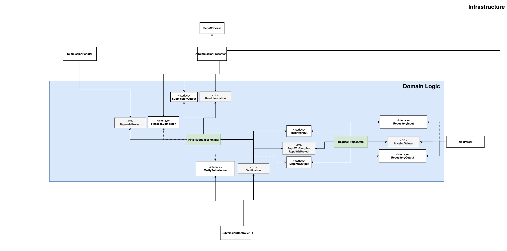

# Finalise Submission

### Use Case Description

Triggers the validation of the project data in the repository plugin and informs the user about missing required project
information.
The final submission is then forwarded to the desired output plugin which can be a file download of the filled template.	

### Input:
1. RepoWizSamples, RepoWizProject

### Output:
1. validated RepoWizSamples and RepoWizProject objects

### Architecture

