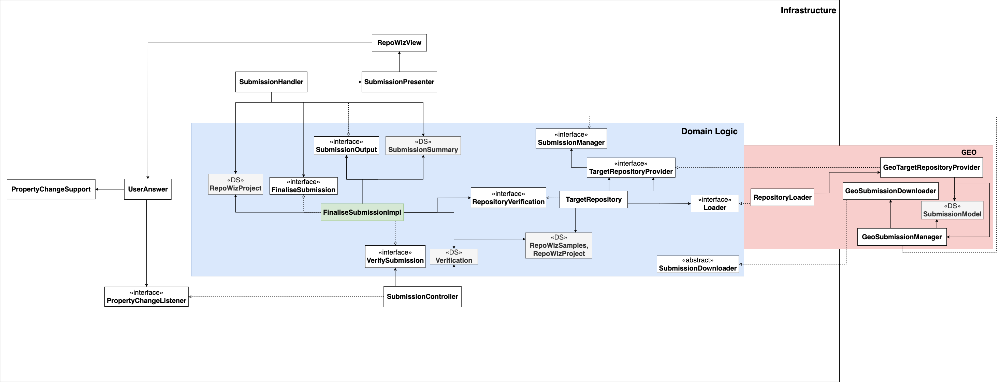

# Finalise Submission

### Use Case Description

Transfers the RepoWiz objects to the suitable repository plugin, triggers the validation of the project data and informs the user about missing required project
information.
The final submission is then forwarded to the desired output plugin which can be a file download of the filled template.	

### Input:
1. RepoWizSamples, RepoWizProject

### Output:
1. validated RepoWizSamples and RepoWizProject objects

### Architecture

The implementation of the Service Provider Interface (SPI) pattern 
allows to handel an unknown number of repository providers 