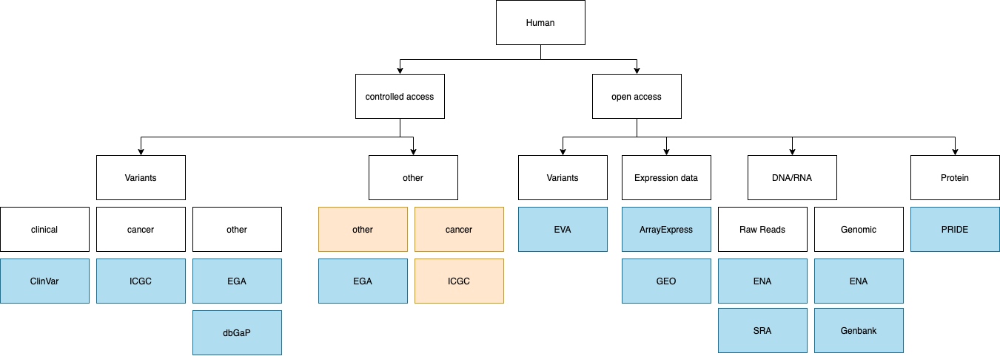
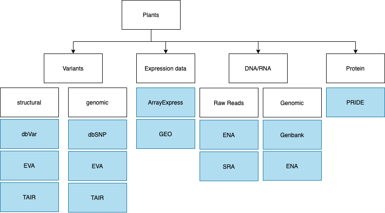
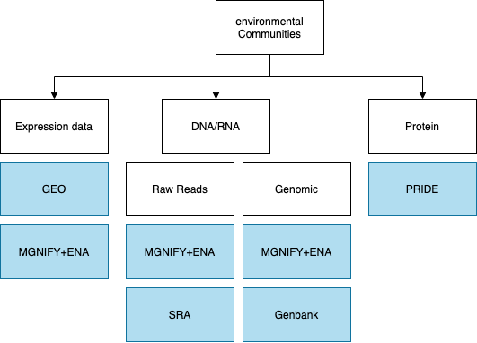
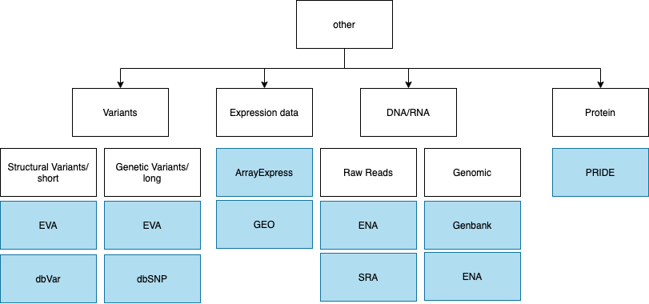
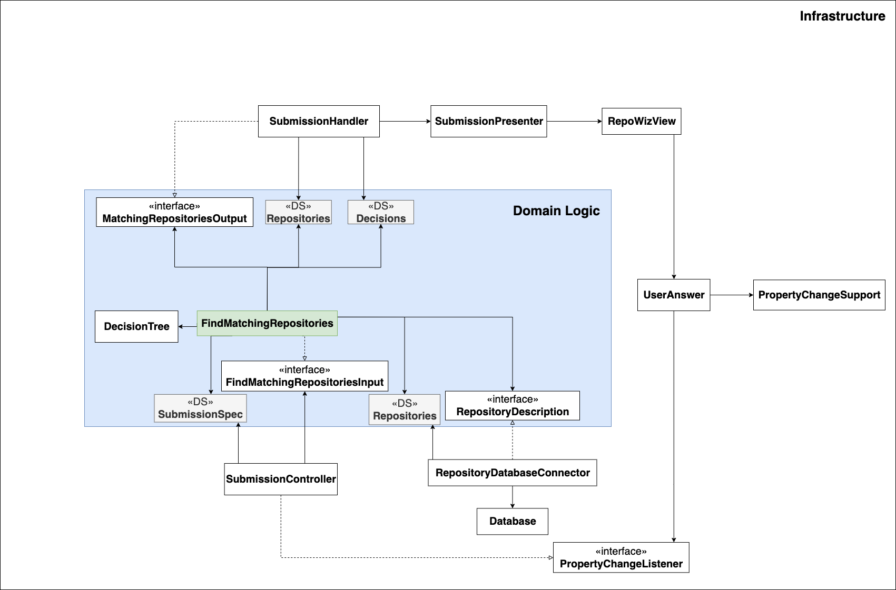

#Find Matching Repositories

### Use Case Description

The system suggests suitable repositories based on the characteristics of a project.
This is implemented with a decision tree. the first level is based on the source organism of the data. In further levels 
information about data and study types are considered.

Part of the decision tree considering human data, it needs to be considered if should be publicly accessible.

Part of the decision tree considering data from plants:

Part of the decision tree considering data from environmental samples:

Part of the decision tree considering data from any other organism like microorganisms:

### Input:
1. Project details from the user
2. Repository descriptions

### Output:
1. Level information from the decision tree
2. Repository objects

### Architecture

