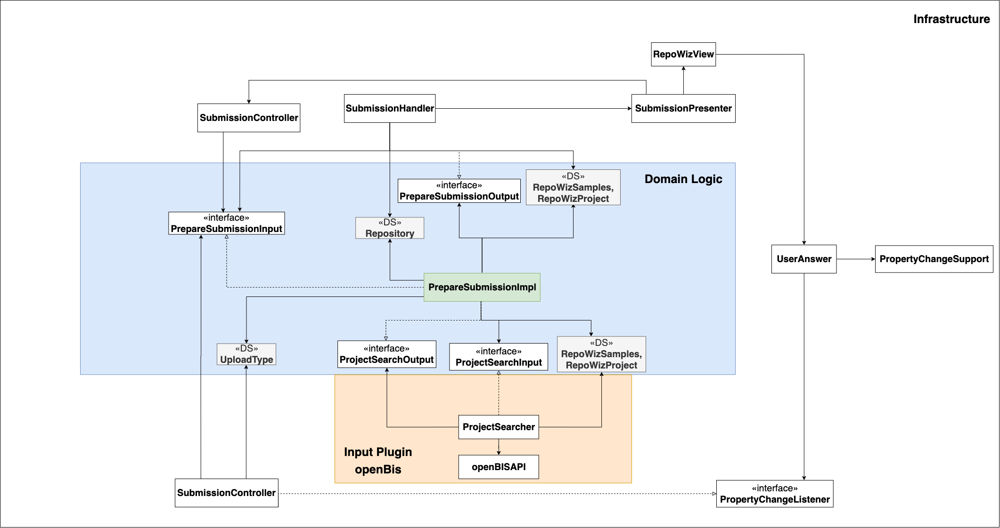

# Prepare Submission

### Use Case Description

RepoWiz transforms the project data from the local database plugin into a flat metadata model (RepoWizProject and RepoWizSamples).
It also checks if the project is valid for the selected repository.

### Input:
1. Project identifier
2. Repository descriptions

### Output:
1. Level information from the decision tree

### Architecture

The input plugin, namely the local DMS of choice, implements
the ProjectSearcher class. This class obtains information on the required
project and returns the project information in form of the RepoWiz
SubmissionModel
		