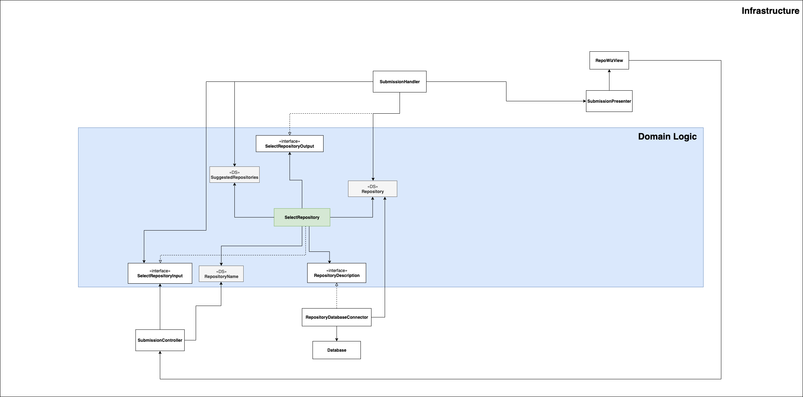

# Select Repository

### Use Case Description

Beside the guide a user can also directly choose a repository. A repository is defined by its name. 
If the user started the guide he can now select one repository from the tools suggestions. 			

### Input:
1. Repository name
2. Repository descriptions

### Output:
1. Repository object

### Architecture

